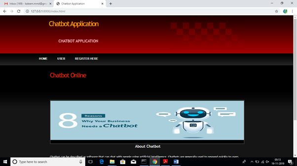
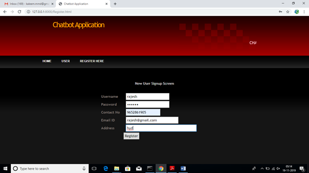
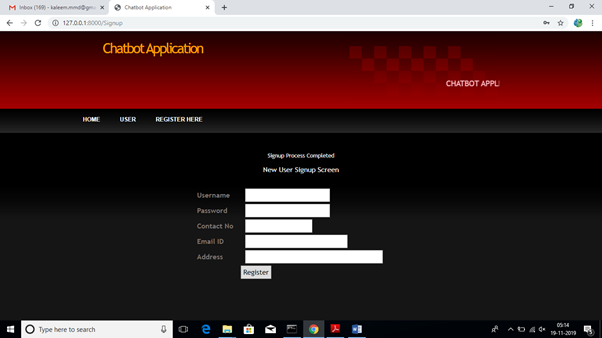
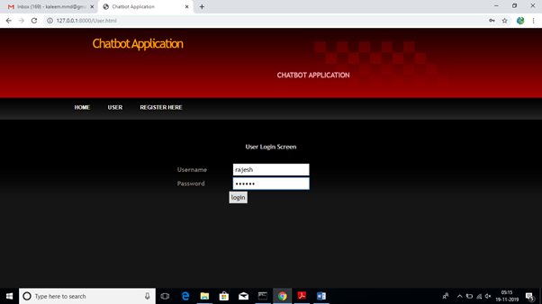
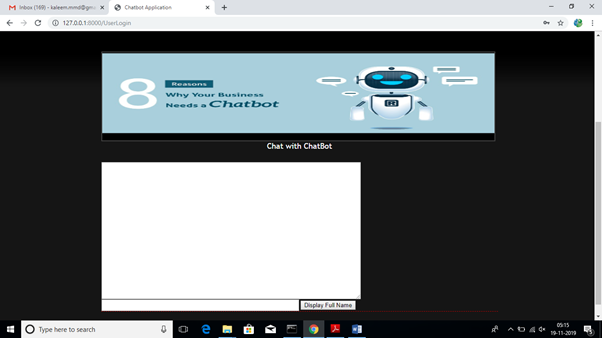
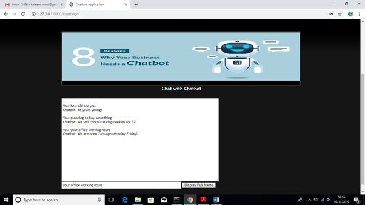

<h1 style="text-align: center;"><strong>Chatbot-using-deep-learning</strong></h1>

## Overview
A chatterbot or chatbot aims to facilitate conversation between humans and machines. The machine is embedded with knowledge to identify sentences and make decisions to respond to questions. The response principle involves matching the input sentence from the user. The input sentence is scored to determine its similarity to reference sentences; a higher score indicates greater similarity.

In this project, sentence similarity is calculated using bigrams, which divide the input sentence into two-letter combinations. The chatbot's knowledge is stored in a database, which serves as both knowledge storage and an interpreter for pattern-matching requirements. The interface is web-based and built using the Python programming language.

## Features
1. Natural Language Processing: The chatbot can understand and process natural language input from users, making the conversation feel more human-like.
2. Sentence Similarity Calculation: It uses bigrams to calculate the similarity of input sentences, ensuring accurate responses based on the user's query.
3. Knowledge Storage: The chatbot's knowledge is stored in a database, allowing it to access and retrieve information efficiently.
4. Pattern Matching: The chatbot employs pattern-matching techniques to identify and respond to user queries accurately.
5. Web-Based Interface: The chatbot interface is web-based, providing an accessible and user-friendly platform for interaction.

## Installation
1. **Clone the Repository**:
   ```bash
   git clone <repository_url>
   cd <repository_name>
2. **Install Dependencies**:
   pip install -r requirements.txt
3. **Set Up MySQL Database**:
   a. Install MySQL and create a new database for the chatbot.
   b. Update the database configuration in the project settings file (settings.py) with your database credentials:
             ```python
            DATABASES = {
                'default': {
                    'ENGINE': 'django.db.backends.mysql',
                    'NAME': '<database_name>',
                    'USER': '<username>',
                    'PASSWORD': '<password>',
                    'HOST': 'localhost',
                    'PORT': '3306',
                }
            }

4. **Start the Server**:
   python manage.py runserver
5. **Access the Application**:
  a. Open your web browser and navigate to the link displayed in the terminal (e.g., http://127.0.0.1:8000/).
  b. Append /index.html at the end of the URL to open the main interface of the chatbot.

## Usage
1. **Start the Server**:  
   Use the following command to start the Django development server:  
   ```bash
   python manage.py runserver
2. **Access the Web Application**:
  a. Open your web browser and navigate to the URL displayed in the terminal (e.g., http://127.0.0.1:8000/).
  b. Append /index.html to the URL to access the chatbot's main interface.
3. **Sign Up or Log In**:
  a. If you are a new user, create an account using the signup page.
  b. Existing users can log in to start interacting with the chatbot.
4. **Interact with the Chatbot**:
  Enter your queries in the chat interface. The chatbot will process the input and respond with relevant answers from its knowledge base.

## Screenshots
### User Interface


### Signup



### Login


### Chatbot Interface



## Contributing
Contributions are welcome! Feel free to report issues, suggest enhancements, or submit pull requests to improve this project. Ensure your contributions align with the project’s goals and coding standards.

### License:
```markdown
## License
This project is licensed under the MIT License.  
You are free to use, modify, and distribute this project as per the terms of the license.  

See the [LICENSE](LICENSE) file for more details.
